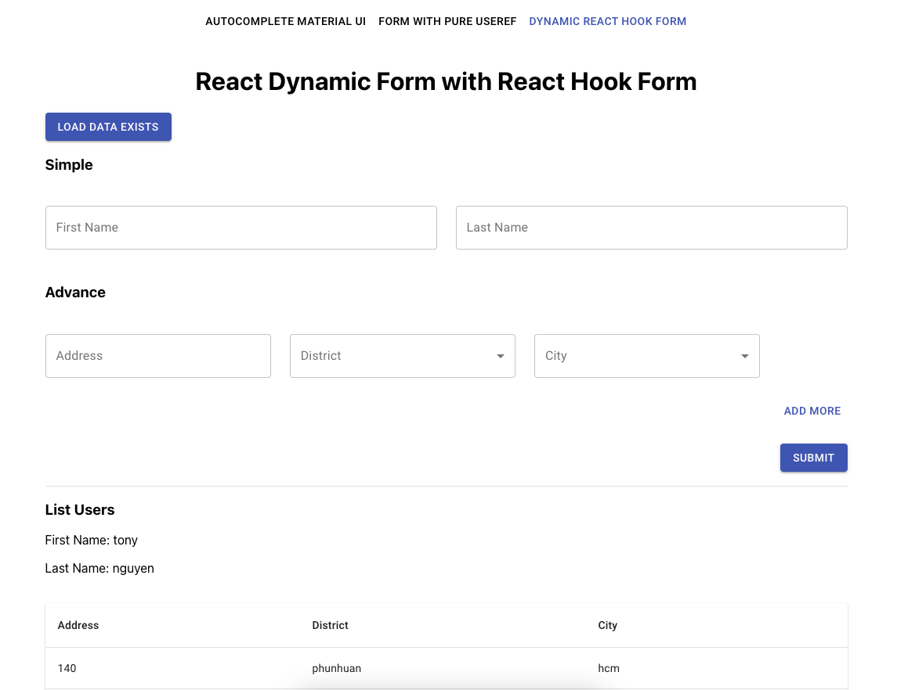

# REACT FORM MATERIAL UI



- Multiple & Group Autocomplete
- Build form with pure useRef react
- Build form dynamic with react hook from
- Build custom input with forwardRef to use react hook form
- Build pure table
  - Flattern data
  - Sort ASC, DESC

## Storybook

```bash
$ npm run storybook
```
